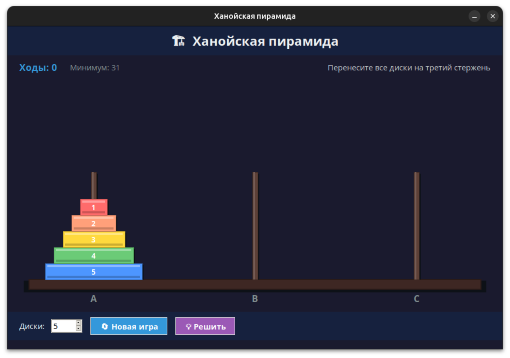

# Ханойская пирамида

Головоломка «Ханойская башня» с графическим интерфейсом на Python (tkinter).

Перенесите все диски с первого стержня на третий, соблюдая правило: нельзя класть больший диск на меньший.

## Скриншот



## Возможности

- Интерактивное перетаскивание дисков кликами мыши
- Выбор количества дисков (от 3 до 8)
- Подсчёт ходов и отображение минимально возможного числа
- Автоматическое решение с пошаговой навигацией (вперёд/назад)
- Определение идеального решения

## Запуск из исходного кода

### Зависимости

- Python 3.10+
- tkinter (входит в стандартную библиотеку Python)

### Запуск

```bash
# Через uv
uv run hanoi.py

# Или напрямую
python hanoi.py
```

## Сборка исполняемого файла

### Windows (.exe)

Требуется [uv](https://docs.astral.sh/uv/) или pip.

```bat
build.bat
```

Результат: `dist/hanoi.exe`

Ручная сборка:

```bash
uv run --with pyinstaller pyinstaller hanoi.spec --noconfirm --collect-all tkinter --collect-all tk
```

### Linux / macOS

```bash
uv run --with pyinstaller pyinstaller hanoi.spec --noconfirm
```

Результат: `dist/hanoi`

> На Linux/macOS tkinter обычно работает без проблем с DLL, поэтому флаги `--collect-all` не требуются.

### Только генерация иконки

```bash
uv run create_icon.py
```

Создаёт файл `hanoi.ico` (мульти-размерный: 16–256px).

## Структура проекта

```
hanoi/
├── hanoi.py            # Основной код игры
├── hanoi.spec          # Конфигурация PyInstaller
├── hanoi.ico           # Иконка приложения
├── create_icon.py      # Генератор иконки (Pillow)
├── hook-runtime-tk.py  # Runtime hook для TCL/TK в PyInstaller
└── build.bat           # Скрипт сборки для Windows
```

## Правила игры

1. На первом стержне (A) расположена пирамида из дисков
2. Цель — перенести все диски на третий стержень (C)
3. За один ход можно переместить только один диск (верхний)
4. Нельзя класть диск большего размера на меньший
5. Минимальное число ходов: **2^n - 1**, где n — количество дисков

## Управление

| Действие | Управление |
|---|---|
| Выбрать диск | Клик по стержню |
| Положить диск | Клик по целевому стержню |
| Снять выделение | Клик по тому же стержню |
| Новая игра | Кнопка «Новая игра» |
| Авторешение | Кнопка «Решить» |

## Лицензия

MIT
